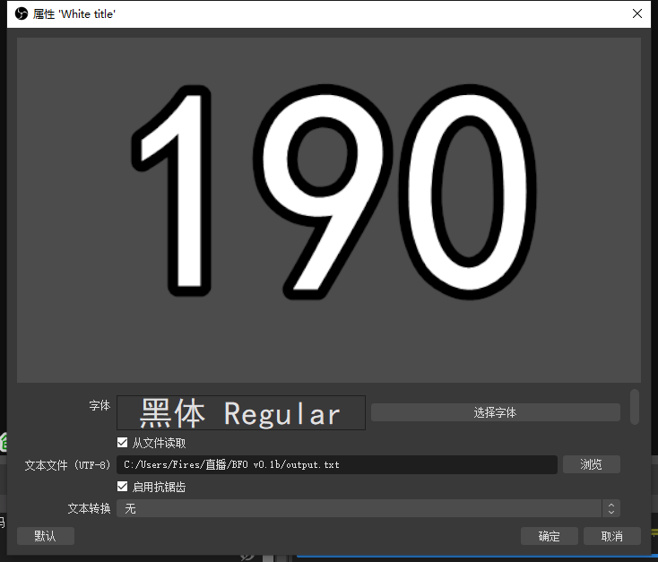

# BFO
Bilibili实时粉丝数监视器

### 介绍
基于Python的B站粉丝实时监视软件，完全开源，欢迎使用！代码借用请标注本仓库谢谢！已用Pyinstaller打包，可直接运行exe，无需环境支持。最新发行版本：v1.0.1！

### 下载&安装教程
完全解压下载好的.zip文件，将所有解压的文件放在同一路径下。即可视为安装完成。  

### 使用说明

1. 先运行main.exe，在输入框内输入UID值和监视频率值，然后点击“开始抓取”
2. 再打开OBS，新建一个文本源
3. 右键单击文本源，打开属性编辑页面
4. 勾选“从文件读取”，并将读取文件选定为BFO目录下的output.txt
5. 确定

### 示例图片

### 应用场景
[2019 B站一哥争夺战](https://www.bilibili.com/video/BV114411i7wS "敖犬战蕾蝗")
[2018 类似的 YouTube一哥争夺战](https://en.wikipedia.org/wiki/PewDiePie_vs_T-Series "PewDiePie与T-Series之争")
