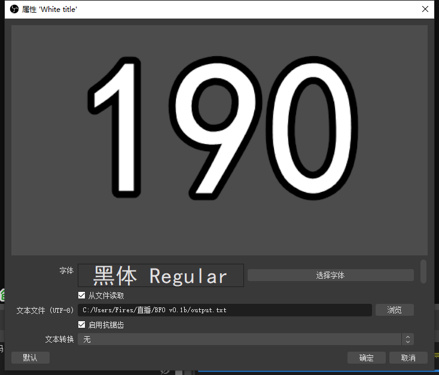

# Bilibili实时粉丝数监视器

#### 介绍
基于Python的B站粉丝实时监视软件，已用Pyinstaller打包。最新版本：v0.2，已更新到Release！

#### 安装教程

完全解压下载好的.zip文件，将所有解压的文件放在同一路径下。即可视为安装完成。

#### 使用说明

1. 先运行BFO.exe，正常完成BFO的引导
2. 再打开OBS，新建一个文本源
3. 右键单击文本源，打开属性编辑页面
4. 勾选“从文件读取”，并将读取文件选定为BFO目录下的output.txt
5. 确定

#### 示例图片

